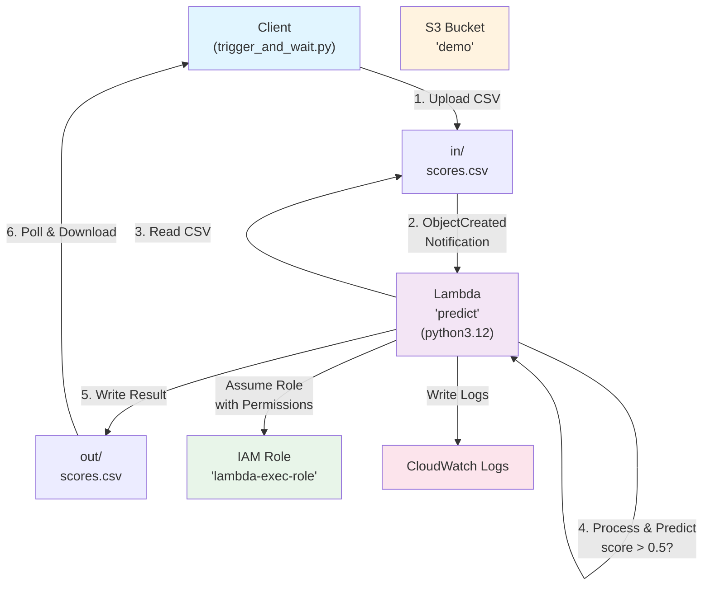
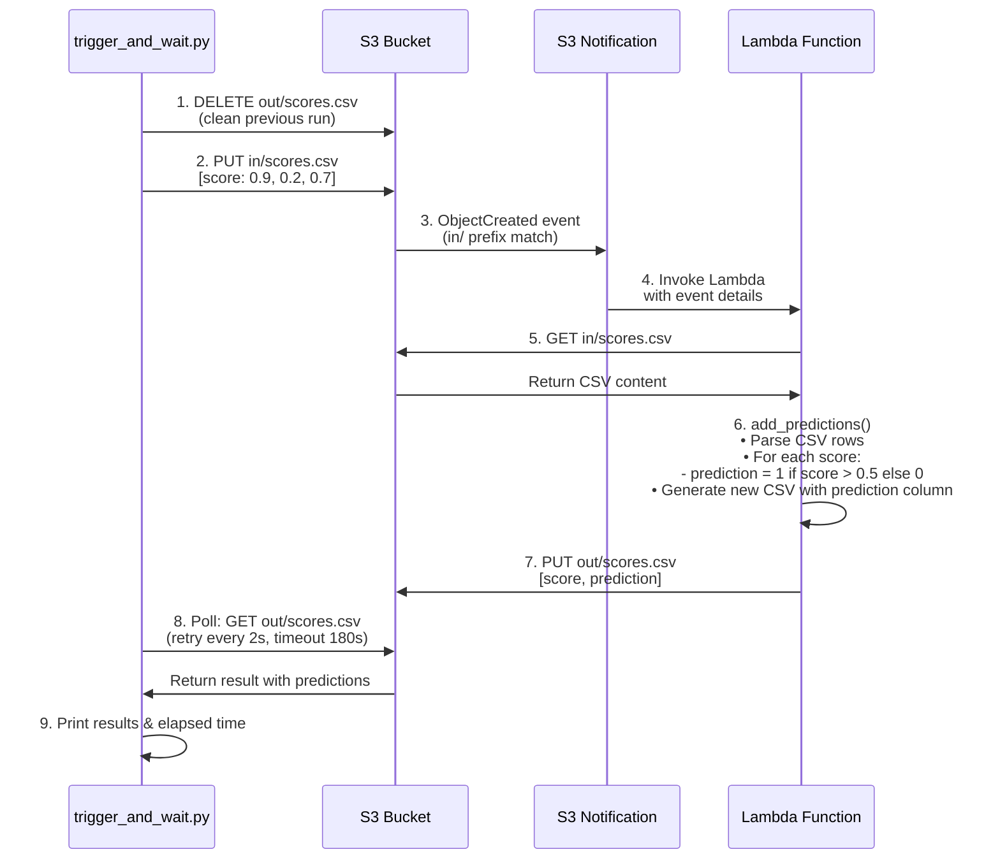

# Demo 1 — S3 → Lambda notification

A Python 3.12 Lambda (`predict`) is automatically triggered by an S3 notification when an object is created under the `in/` prefix of the `demo` bucket. It reads the CSV, adds a `prediction` column (`1` if `score > 0.5`, else `0`), and writes the result under `out/` with the same file name.

## Architecture



## Execution Flow



### Step-by-Step Breakdown

1. **Setup**: Delete any stale output from a previous run
2. **Trigger**: Upload a CSV file to `in/scores.csv`
3. **S3 Notification**: S3 detects the new object matches the `s3:ObjectCreated:*` filter on `in/` prefix
4. **Lambda Invocation**: S3 automatically invokes the `predict` Lambda with event details
5. **Data Fetch**: Lambda reads the uploaded CSV from S3
6. **Prediction Logic** (in `add_predictions()`):
   - Parse each row from the CSV
   - For each `score` value: compute `prediction = 1 if score > 0.5 else 0`
   - Write a new CSV with both `score` and `prediction` columns
7. **Result Storage**: Lambda writes the enriched CSV to `out/scores.csv`
8. **Polling**: The client polls S3 every 2 seconds for the output file
9. **Result Display**: Once found, print the predictions and total elapsed time

## Resources created

- IAM role `lambda-exec-role` (trust policy `lambda.amazonaws.com`), with an inline policy scoped to S3 read on `demo/in/*`, S3 write on `demo/out/*`, and CloudWatch Logs
- Lambda function `predict` (runtime `python3.12`, zip, 60s timeout)
- S3 bucket `demo`
- Lambda permission `lambda:InvokeFunction` for the `s3.amazonaws.com` principal
- S3 notification `s3:ObjectCreated:*` filtered on the `in/` prefix

## Run the demo

```bash
make up
make demo1
```

Manual equivalent:

```bash
docker compose exec -T runner uv run python demos/01-s3-lambda-notification/deploy.py
docker compose exec -T runner uv run python demos/01-s3-lambda-notification/trigger_and_wait.py
```

Or step through it live, one AWS call at a time, in [`notebook/masterclass_demo.ipynb`](../../notebook/masterclass_demo.ipynb) (`make notebook`).

## Expected result

```
score,prediction
0.9,1
0.2,0
0.7,1
```

Typical delay observed: ~30s on the first trigger (downloading the `public.ecr.aws/lambda/python:3.12` runtime image), much faster afterwards.
